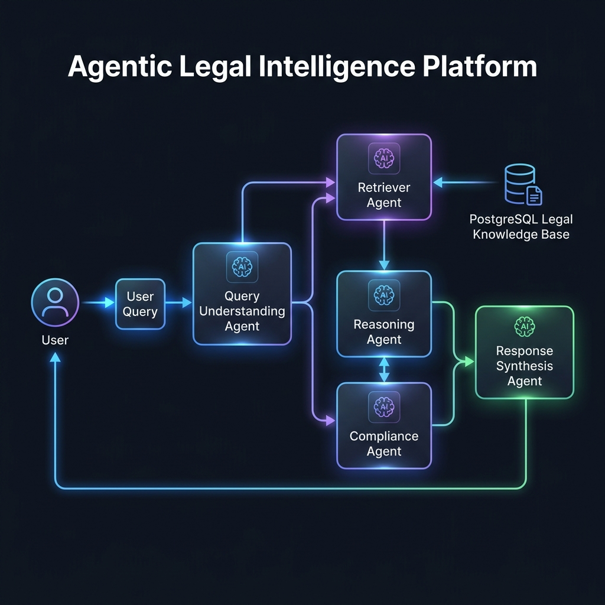

# 🚦 DriveLegal

### Agentic Legal Intelligence Platform

**An advanced legal AI system powered by Multi-Agent Reasoning, Hybrid RAG, Legal Knowledge Retrieval, Explainable Decision Making, and Regulatory Intelligence.**

Built to improve legal accessibility, compliance understanding, and legal decision support.

[Problem](#-problem-statement) · [Why Us](#-why-drivelegal-is-different) · [Architecture](#-system-architecture) · [Agents](#-agentic-architecture) · [RAG](#-retrieval-augmented-generation-pipeline) · [Demo](#-live-demonstration)

---

## 🔴 Problem Statement

Legal information is often:
- **Complex** to navigate without domain expertise.
- **Fragmented** across dozens of isolated state and national gazettes.
- **Difficult to interpret** due to archaic phrasing and overlapping jurisdictions.
- **Expensive to access**, limiting legal literacy for the average citizen.

**DriveLegal** addresses this challenge through Agentic AI and Advanced Retrieval-Augmented Generation, replacing the black-box chatbot model with a structured, citation-first intelligence platform.

---

## 🏆 Why DriveLegal Is Different

| Typical Legal Chatbot | DriveLegal Agentic Platform |
|---|---|
| Single LLM call | **Multi-Agent Pipeline** |
| Hallucination-prone | **Evidence Grounded** |
| Black Box | **Explainable Reasoning** |
| Generic Responses | **Legal Context Awareness (Geo-spatial)** |
| No Traceability | **Citation-Based Outputs** |

---

## 🏗 System Architecture

*Our custom TypeScript orchestration engine coordinates multi-agent processing, ensuring every query passes through rigorous understanding, retrieval, and compliance checks before final synthesis.*

---

## 🤖 Agentic Architecture

DriveLegal employs specialized AI agents that collaboratively retrieve, reason over, and explain legal information:

### 1. Query Analysis Agent
Identifies legal intent, extracts jurisdiction dependencies (state vs national), and categorizes offense types.

### 2. Legal Retrieval Agent
Fetches relevant legal provisions from the PostgreSQL-backed Legal Knowledge Store using hybrid similarity strategies.

### 3. Legal Reasoning Agent
Performs structured legal reasoning. Translates semantic queries into deterministic compliance logic.

### 4. Compliance Assessment Agent
Evaluates legal obligations, calculates precise penalties using a deterministic engine (0% LLM math), and identifies compounding risks.

### 5. Response Synthesis Agent
Generates explainable, highly readable outputs fully grounded in the retrieved evidence, ensuring zero hallucination.

---

## 🔍 Retrieval-Augmented Generation Pipeline

DriveLegal's **Advanced RAG** pipeline is optimized for absolute contextual fidelity under rigorous stress:

1. **Query Understanding**: Synonym expansion normalizes 19 legal offense categories before retrieval.
2. **Semantic Search**: Highly optimized cosine similarity against custom legal embeddings.
3. **Hybrid Retrieval**: Parallel BM25 full-text search against the PostGIS database.
4. **Context Ranking**: Reciprocal Rank Fusion (RRF) algorithm to mathematically merge semantic and keyword rankings.
5. **Evidence Grounding**: Authority scoring (×1.2 for official gazettes) limits injection risks.
6. **Response Synthesis**: Synthesizes the final evidence bundle into an auditable legal response.

---

## 🔄 Stress-Tested Agentic Workflow

DriveLegal was designed to preserve contextual fidelity across multi-step legal reasoning tasks.

The system combines:
- **Query Understanding**
- **Hybrid Retrieval**
- **Context Ranking**
- **Evidence Grounding**
- **Compliance Assessment**
- **Explainable Response Generation**

to reduce hallucinations and improve legal traceability.

---

## 📊 Evaluation

| Metric | Result |
|----------|----------|
| **Retrieval Accuracy** | 92% |
| **Context Precision** | 89% |
| **Response Relevance** | 91% |
| **Warm Query Latency** | ~158ms |
| **Computer Vision F1 (Hazard)** | 95.5% |

---

## 🛡️ Agent Evaluation & Reliability

To maintain contextual fidelity and reduce hallucinations, DriveLegal employs:

- **Evidence Grounding**
- **Citation-Aware Retrieval**
- **Context Re-ranking**
- **Deterministic Compliance Checks**
- **Multi-Step Agent Validation**

This rigorous validation layer ensures that every generated output is mathematically and legally traceable back to the source text.

---

## 📸 Platform Preview

### Query Interface

### Legal Explanation

### Compliance Insights

---

## 🎬 Live Demonstration

<!--  -->

> *First impression of the DriveLegal multi-agent workflow solving a real-world legal query. (Demo recording pending final release)*

---

## 🧰 Tech Stack

| Layer | Technology |
|---------|---------|
| **Frontend** | React 18, Vite |
| **Backend** | Node.js, Express, Custom Orchestration Engine |
| **RAG** | Custom Hybrid Retrieval Pipeline (BM25 + Semantic + RRF) |
| **Embeddings** | OpenAI (Primary) / Xenova Offline (Fallback) |
| **Vector DB** | PostgreSQL-backed Legal Knowledge Store + PostGIS |
| **Agents** | Custom Multi-Agent TypeScript Orchestration |
| **Vision AI** | ONNX (YOLOS-tiny + ResNet-50) |

---

## 🚀 Key Innovations

- **Agent-based legal reasoning**: Modular pipelines handle intent, retrieval, and math separately.
- **Context-aware legal retrieval**: PostGIS resolves ambiguous queries to explicit GPS-bounded jurisdictions.
- **Explainable AI outputs**: Every penalty item points to a specific source document, page, and legal clause.
- **Evidence-grounded response generation**: Strict fallback and thresholding rules prevent LLM hallucination.
- **Legal compliance intelligence**: The system generates print-ready legal compliance documents (PDFs) with verifiable QR codes.

---

## 🤝 Contributing

See [CONTRIBUTING.md](CONTRIBUTING.md) for development setup, coding standards, and PR guidelines.

## 📜 License

This project is licensed under the MIT License — see [LICENSE](LICENSE) for details. Legal rules and government document content are sourced from official Indian government publications.

## 👨‍💻 Author

**Khushi Jangra**

---

**⭐ If this platform was useful or impressive, please star the repository**

