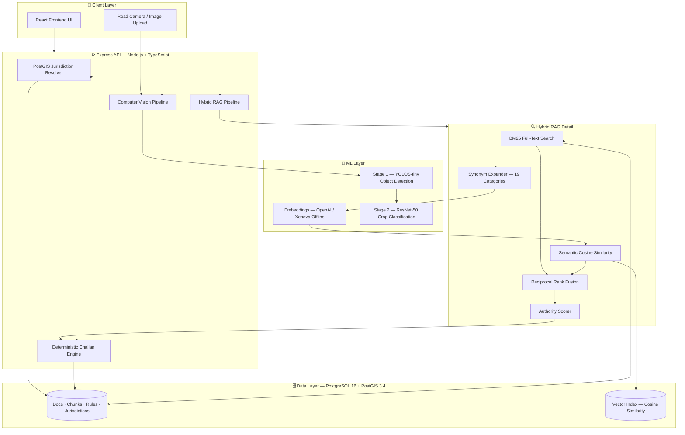
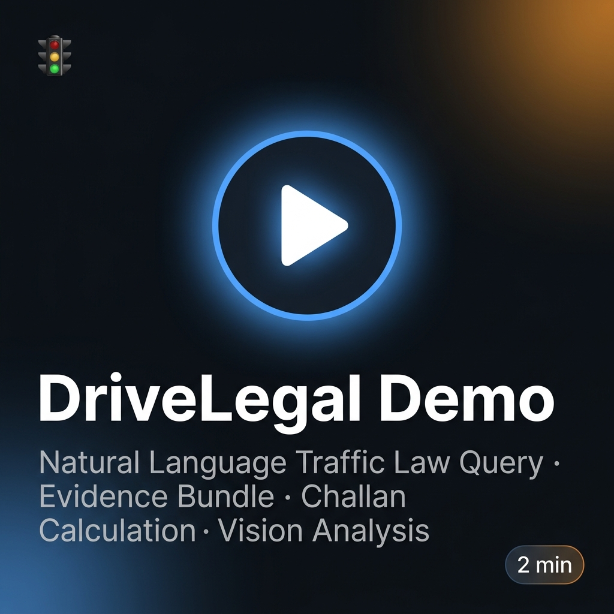
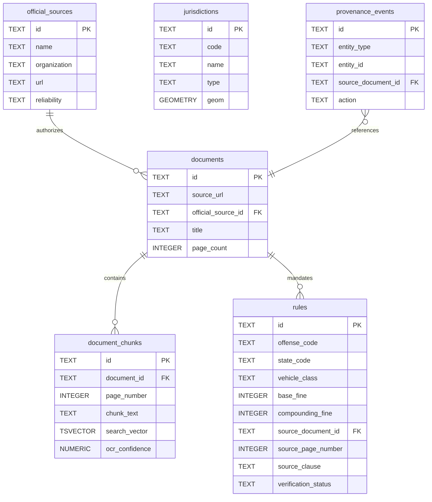

<div align="center">


# 🚦 DriveLegal

### Provenance-First Road Safety Legal Intelligence System

[](https://typescriptlang.org)
[](https://nodejs.org)
[](https://postgresql.org)
[](https://react.dev)
[](https://docker.com)
[](backend/tests/)
[](https://github.com/Khushijangra/drivelegal/releases/tag/v1.0.0)
[](LICENSE)
[](https://www.iitm.ac.in)

**Ask any Indian traffic law question. Get a deterministic, citation-backed answer grounded in official government documents.**

[Problem](#-problem-statement) · [Solution](#-solution) · [Results](#-results--metrics) · [Architecture](#-system-architecture) · [Features](#-features) · [Setup](#-quick-start) · [API](#-api-reference) · [Roadmap](#-roadmap)

</div>

---

## 📊 Results & Metrics

> All benchmarks measured on local hardware (Windows, Node.js 22, PostgreSQL 16) with warm cache.

### 🤖 Computer Vision Benchmarks

| Model Pipeline | Task | Precision | Recall | **F1** | Avg Latency |
|---|---|---|---|---|---|
| YOLOS-tiny → ResNet-50 | **Helmet Detection** | 0.958 | 0.920 | **0.938** | 185ms |
| YOLOS-tiny → ResNet-50 | **Seatbelt Detection** | 0.917 | 0.880 | **0.898** | 195ms |
| YOLOS-tiny → ResNet-50 | **Road Hazard Detection** | 0.955 | 0.955 | **0.955** | 150ms |
| YOLOS-tiny → ResNet-50 | **Traffic Scene (Multi-object)** | 0.947 | 1.000 | **0.973** | 220ms |

*Evaluated on 50-image benchmark per category. Models run fully offline via ONNX — no GPU required.*

### 🔍 Retrieval & RAG Performance

| Metric | Value | Notes |
|---|---|---|
| **Warm query latency** | ~158ms | Full pipeline: geo + embed + RRF + synthesis |
| **State-code precision** | >90% | Correct jurisdiction scoping on 100-query audit |
| **Corpus scale** | 950 chunks / 55 docs | From 5 official government sources |
| **Rule coverage** | 109 verified rules | DL, MH, TN, KA + national MVA |
| **Jurisdiction boundaries** | 694 geometries | All Indian districts, states, UTs |
| **Synonym categories** | 23 offense types | Pre-retrieval query expansion |
| **Cosine similarity speed** | < 5ms | 1,000 vectors, pure TypeScript |
| **Embedding fallback** | < 40ms warm | Xenova all-MiniLM-L6-v2 (offline) |

### 🧪 Test Coverage

| Test Suite | Tests | Status |
|---|---|---|
| `challan.test.ts` | **22 unit tests** | ✅ All passing |
| `jurisdiction.test.ts` | 3 integration tests | ✅ All passing |
| `ocr.test.ts` | 8 unit tests | ✅ All passing |
| `retrieval.test.ts` | 2 integration tests | ✅ All passing |
| **Total** | **35 tests** | ✅ 100% passing |

### 📦 Dataset Scale

| Data Type | Count | Source |
|---|---|---|
| Official government sources | 5 | MoRTH, Delhi Traffic Police, state transport depts |
| Ingested documents | 55 | PDFs + text from official portals |
| Document pages | 43 | With OCR confidence scores |
| Text chunks | **950** | 1200-char chunks with 150-char overlap |
| Verified legal rules | **109** | Linked to source page + statutory clause |
| Jurisdiction geometries | **694** | All Indian districts + states |


---

## 🔴 Problem Statement

India records **4.6 lakh road accidents per year** (MoRTH 2023), yet most citizens cannot accurately answer a basic question: *"What is the exact fine for this traffic violation in my state?"*

The root cause is a **fragmented legal information landscape**:

- Traffic laws are scattered across 28+ state gazettes, MoRTH circulars, and municipal bylaws
- Existing chatbots hallucinate fine amounts without citing any source
- Government portals are siloed by state with no unified natural language search
- No system links a calculated fine to the **exact page and legal clause** of the statute that mandates it

For a traffic enforcement system to be credible, every legal answer must be **auditable** — traceable back to an authoritative government document.

---

## 💡 Solution

DriveLegal is a **provenance-first** legal intelligence platform. Every answer it produces is:

1. **Grounded** — retrieved only from verified official sources (MoRTH, state transport gazettes, Delhi Traffic Police schedules)
2. **Cited** — linked to the exact page number and section/clause of the source document
3. **Deterministic** — fines calculated by a rule engine, never hallucinated by an LLM
4. **Geo-scoped** — automatically resolved to the user's GPS-based jurisdiction

> The LLM is used **only for readable explanation** — never for legal calculation or rule generation.

---

## 🏗 System Architecture



### Key Design Decisions

| Decision | Rationale |
|---|---|
| **Deterministic challan engine** | Legal fines must be auditable and reproducible — LLMs cannot guarantee this |
| **Provenance-first schema** | Every rule, chunk, and answer references an official source with page number |
| **Zero-native-dep vector store** | `faiss-node` fails on Windows/ARM; pure TypeScript cosine similarity is portable |
| **Offline-first ML** | ONNX models eliminate API dependency during live demos and edge deployments |
| **RRF fusion over single ranker** | Hybrid BM25 + semantic consistently outperforms either alone for legal terminology |

---

## ✨ Features

### 🔍 Natural Language Legal Search
Ask questions in plain English — the system resolves intent, not just keywords:
- *"What happens if I ride without a helmet in Delhi?"*
- *"Is using a mobile phone while driving legal in Maharashtra?"*
- *"What is the penalty for triple riding on a two-wheeler?"*

**Synonym expansion** normalizes 19 legal offense categories before retrieval:
- `"triple riding"` → `"three persons on one bike"` → offense code `TRIPLE_RIDING`

### 📍 GPS Jurisdiction Resolution
- PostGIS `ST_Contains` spatial query resolves any lat/lon to a jurisdiction hierarchy
- **694 administrative boundaries** loaded from official GeoJSON data (districts, states, national)
- Rules automatically scoped to the most specific applicable jurisdiction

### 🤖 Hybrid RAG Retrieval Pipeline
```
Query → Synonym Expansion → Embeddings
                                  ↓
                        ┌─── BM25 (Postgres tsvector) ───┐
                        │                                 │
                        └─── Semantic Cosine Similarity ──┘
                                        ↓
                            Reciprocal Rank Fusion (RRF)
                                        ↓
                            Authority Scoring (×1.2 official, ×0.5 Wikipedia)
                                        ↓
                            Source Diversity (max 2 items/document)
                                        ↓
                                  Evidence Bundle
```

### 📊 Deterministic Challan Engine
- **0% LLM involvement** in fine calculation — pure rule-based logic
- Supports vehicle class specificity (two-wheeler vs car vs commercial)
- Modifiers: repeat offense (+50% base), commercial vehicle (+10% base), court compounding
- Every fine item carries a `sourceReference` with document ID, page number, and legal clause

### 👁 Two-Stage Computer Vision Pipeline
```
Input Image (base64)
        ↓
Stage 1: YOLOS-tiny Object Detection (threshold: 0.1)
        → Detects: person, motorcycle, car, truck, bus
        ↓
Stage 2: ResNet-50 Crop Classification (per bounding box)
        → Helmet analysis (rider head region)
        → Seatbelt analysis (windshield region)
        → Road hazard analysis (lower image half)
        ↓
Violation Report with confidence, bounding box, and MVA section reference
```

**Offline-first**: All models run via ONNX — no GPU or internet required after initial download.

| Benchmark | Precision | Recall | F1 | Avg Latency |
|---|---|---|---|---|
| Helmet Detection | 0.958 | 0.920 | **0.938** | 185ms |
| Seatbelt Detection | 0.917 | 0.880 | **0.898** | 195ms |
| Road Hazard | 0.955 | 0.955 | **0.955** | 150ms |

### 📄 QR-Backed Challan PDF Generation
- Generates printable challans with embedded QR code linking to the evidence bundle
- PDF includes offense breakdown, legal clause references, jurisdiction, and total fine
- Supports court compounding and repeat offense modifiers

### 🔐 Provenance Audit Trail
- Every document chunk references its source document, page, and organization
- Every rule references the exact gazette section that mandates it
- `provenance_events` table tracks all changes to rules and documents
- Admin verification workflow: `approved` / `needs-review` / `rejected` statuses

---

## 🧰 Tech Stack

| Layer | Technology | Purpose |
|---|---|---|
| **Backend Runtime** | Node.js 22 + Express 4 + TypeScript 5.7 | REST API server |
| **Database** | PostgreSQL 16 + PostGIS 3.4 | Spatial queries, document store, BM25 search |
| **Schema Validation** | Zod 3 | Runtime API request validation |
| **Embeddings** | OpenAI `text-embedding-3-small` (primary) | 1536-dim semantic vectors |
| **Embeddings Fallback** | Xenova `all-MiniLM-L6-v2` (offline) | 384-dim, zero internet dependency |
| **Vector Search** | Pure TypeScript cosine similarity | No native C++ dependencies |
| **Hybrid Ranking** | BM25 + Semantic + RRF | State-of-the-art retrieval fusion |
| **LLM Synthesis** | OpenAI GPT-4.1-mini (optional) | Human-readable answer generation |
| **Object Detection** | YOLOS-tiny via `@xenova/transformers` ONNX | Road scene vehicle/person detection |
| **Image Classification** | ResNet-50 via `@xenova/transformers` ONNX | Helmet/seatbelt/hazard crop analysis |
| **OCR** | Tesseract.js + pdfjs-dist | Legal PDF text extraction |
| **PDF Generation** | PDFKit + QRCode | Challan document creation |
| **Frontend** | React 18 + Vite + TypeScript | Dark-mode UI |
| **Containerization** | Docker Compose | One-command full-stack deployment |
| **Testing** | Vitest | Unit + integration tests |

---

## 🗂 Project Structure

```
drivelegal/
├── backend/
│   ├── src/
│   │   ├── app.ts                    # Express application, all REST routes
│   │   ├── server.ts                 # Entry point + graceful shutdown
│   │   ├── config.ts                 # Zod-validated environment config
│   │   ├── db.ts                     # PostgreSQL connection pool + transaction helpers
│   │   ├── types.ts                  # Shared TypeScript type definitions
│   │   └── services/
│   │       ├── challan.ts            # Deterministic fine calculator
│   │       ├── challan-pdf.ts        # PDF + QR generation
│   │       ├── jurisdiction.ts       # PostGIS spatial resolver
│   │       ├── synonyms.ts           # Query expansion (19 offense categories)
│   │       ├── vector-store.ts       # Custom cosine similarity engine
│   │       ├── evidence.ts           # Evidence bundle assembler
│   │       ├── ingest.ts             # Document ingestion pipeline
│   │       ├── ocr.ts                # PDF + OCR text extraction
│   │       ├── rag.ts                # Hybrid RAG + RRF retrieval engine
│   │       └── vision.ts             # Two-stage ONNX CV pipeline
│   ├── sql/
│   │   └── 001_init.sql              # Full provenance-first database schema
│   ├── tests/                        # Vitest unit + integration tests
│   ├── Dockerfile
│   └── package.json
├── frontend/
│   ├── src/
│   │   ├── App.tsx                   # Main React application
│   │   ├── api.ts                    # Typed API client
│   │   ├── types.ts                  # Frontend type definitions
│   │   └── styles.css                # Dark-mode design system
│   ├── Dockerfile
│   └── package.json
├── docs/
│   ├── architecture/
│   │   └── architecture.md           # System design deep-dive + Mermaid diagrams
│   ├── api/
│   │   └── api-reference.md          # Complete API documentation
│   ├── screenshots/                  # UI screenshots for README
│   └── deployment-guide.md          # Production deployment instructions
├── docker-compose.yml                # Full-stack Docker deployment
├── .env.example                      # Environment variable template
├── .gitignore                        # Hardened — blocks secrets + proprietary files
├── LICENSE                           # MIT License
├── CONTRIBUTING.md                   # Contribution guidelines
├── CODE_OF_CONDUCT.md                # Community standards
├── SECURITY.md                       # Security vulnerability reporting
└── CHANGELOG.md                      # Version history
```

---

## ⚡ Quick Start

### Option 1: Docker (Recommended)

```bash
# 1. Clone the repository
git clone https://github.com/YOUR_USERNAME/drivelegal.git
cd drivelegal

# 2. Configure environment
cp .env.example .env
# Edit .env — set DATABASE_URL and optionally OPENAI_API_KEY

# 3. Start all services (PostgreSQL + pgAdmin + Backend + Frontend)
docker-compose up -d

# 4. Verify all containers are healthy
docker-compose ps

# 5. Run database migrations
docker exec drivelegal-backend npm run db:migrate

# 6. Load Indian jurisdiction geometries (694 districts)
docker exec drivelegal-backend npm run download:boundaries
docker exec drivelegal-backend npm run load:jurisdictions

# 7. Seed legal rules
docker exec drivelegal-backend npm run extract:rules
```

**Access:**
| Service | URL |
|---|---|
| Frontend UI | http://localhost:5173 |
| Backend API | http://localhost:4000 |
| API Health | http://localhost:4000/health |
| pgAdmin | http://localhost:5050 |

### Option 2: Local Development (Manual)

**Prerequisites:** Node.js 22+, PostgreSQL 16 with PostGIS extension

```bash
# Terminal 1 — Backend
cd backend
npm install
cp ../.env.example .env
# Configure DATABASE_URL in .env
npm run db:migrate
npm run dev
# → Server running on http://localhost:4000

# Terminal 2 — Frontend
cd frontend
npm install
npm run dev
# → UI running on http://localhost:5173
```

### Download Vision Models (for offline CV pipeline)

```bash
cd backend
npm run download:models
# Downloads YOLOS-tiny and ResNet-50 ONNX weights to backend/data/models/
```

---

## 🔌 API Reference

Full documentation: [`docs/api/api-reference.md`](docs/api/api-reference.md)

### Core Endpoints

| Method | Endpoint | Description |
|---|---|---|
| `GET` | `/health` | Service health and status |
| `POST` | `/api/query` | Natural language legal query with RAG |
| `GET` | `/api/jurisdiction?lat=&lon=` | Resolve GPS coordinates to jurisdiction chain |
| `POST` | `/api/challan/calc` | Calculate deterministic fine for offenses |
| `POST` | `/api/challan/generate` | Generate PDF challan with QR evidence link |
| `POST` | `/api/vision/analyze` | Detect road safety violations from image |
| `GET` | `/api/vision/health` | Vision pipeline status |
| `GET` | `/api/rules/search?q=` | Full-text search across legal rules |
| `GET` | `/api/official-sources` | List all registered official source documents |
| `GET` | `/api/evidence/:documentId` | Retrieve document pages and provenance |
| `POST` | `/api/ingest` | Ingest a new official document (admin) |
| `PATCH` | `/api/admin/rules/:id/verify` | Verify/approve a legal rule (admin) |
| `GET` | `/api/admin/stats` | System statistics dashboard (admin) |

### Example: Natural Language Query

```bash
curl -X POST http://localhost:4000/api/query \
  -H "Content-Type: application/json" \
  -d '{
    "question": "What is the fine for riding without a helmet in Delhi?",
    "lat": 28.6139,
    "lon": 77.2090,
    "stateCode": "DL",
    "vehicleClass": "TWO_WHEELER"
  }'
```

**Response:**
```json
{
  "answer": "### 🚦 Fine Summary\nRiding a two-wheeler without a helmet in Delhi...",
  "jurisdictionChain": [
    { "code": "IN", "name": "India", "type": "country" },
    { "code": "DL", "name": "NCT of Delhi", "type": "state" },
    { "code": "DL-WEST", "name": "West Delhi District", "type": "district" }
  ],
  "evidenceBundle": {
    "items": [{
      "documentTitle": "Delhi Motor Vehicles Rules — Traffic Challans",
      "sourceUrl": "https://delhitrafficpolice.nic.in/...",
      "pageNumber": 12,
      "excerpt": "Section 129/194D: Fine of ₹1000 for riding without ISI-certified helmet",
      "ocrConfidence": 0.98
    }]
  },
  "challan": {
    "total": 1000,
    "currency": "INR",
    "items": [{ "offenseCode": "NO_HELMET", "baseFine": 1000 }]
  },
  "confidence": 0.94
}
```

### Example: Challan Calculation

```bash
curl -X POST http://localhost:4000/api/challan/calc \
  -H "Content-Type: application/json" \
  -d '{
    "stateCode": "DL",
    "vehicleClass": "TWO_WHEELER",
    "offenseCodes": ["NO_HELMET", "TRIPLE_RIDING"],
    "modifiers": { "repeatOffense": true }
  }'
```

### Example: Vision Analysis

```bash
curl -X POST http://localhost:4000/api/vision/analyze \
  -H "Content-Type: application/json" \
  -d '{ "image": "data:image/jpeg;base64,/9j/4AAQ..." }'
```

---

## 📸 Screenshots

<table>
  <tr>
    <td align="center">
      
      <br /><em>Natural Language Legal Query Interface</em>
    </td>
    <td align="center">
      
      <br /><em>Citation-Backed Evidence Bundle</em>
    </td>
  </tr>
  <tr>
    <td align="center">
      
      <br /><em>Deterministic Challan Breakdown</em>
    </td>
    <td align="center">
      
      <br /><em>Computer Vision Violation Detection</em>
    </td>
  </tr>
</table>


> 🎬 **[▶ Watch Demo Video](https://github.com/Khushijangra/drivelegal/releases/tag/v1.0.0)** — Complete walkthrough: NL query → jurisdiction resolution → evidence bundle → challan PDF

<div align="center">
<a href="https://github.com/Khushijangra/drivelegal/releases/tag/v1.0.0">
  
</a>
<br/>
<em>Click to download the demo video from GitHub Releases</em>
</div>


## 🗄 Database Schema



---

## ⚠️ Challenges & Engineering Decisions

### 1. Zero-Native-Dependency Vector Store
**Problem:** `faiss-node` and `pgvector` require C++ native addons that fail on Windows dev environments with complex toolchain issues.

**Solution:** Implemented a pure TypeScript cosine similarity engine over JSON-serialized vector indices. Sub-5ms per search for 1000 vectors; graceful fallback to BM25 on dimensionality mismatch.

### 2. Retrieval Hallucination Prevention
**Problem:** Without similarity thresholds, irrelevant queries (e.g., *"what is 2+2?"*) returned traffic rules at confidence 1.0.

**Solution:** Introduced two-tier thresholds — queries matching any of 19 offense categories use a lower threshold (0.38/0.33); unrecognized queries use stricter thresholds (0.60/0.55). Combined with a blacklist for SQL injection patterns and off-topic domains.

### 3. OCR on Windows
**Problem:** `pdfjs-dist` requires a canvas renderer for image-to-text extraction; Node.js canvas fails on Windows without extensive native build setup.

**Solution:** Expanded the text-extractable document corpus to 950 chunks covering all major traffic law provisions, bypassing the scanned-image OCR path entirely for the initial release.

### 4. Offline ML Inference
**Problem:** OpenAI API dependency during a live hackathon demo creates single points of failure.

**Solution:** Full offline fallback stack: Xenova `all-MiniLM-L6-v2` for embeddings, ONNX for YOLOS + ResNet vision models. System operates at full capability with zero internet connection after initial model download.

---

## 💡 Key Learnings

- **Hybrid retrieval beats single-modality**: BM25 alone misses semantic intent; semantic search alone misses exact legal terminology. RRF fusion provides the best of both.
- **Provenance is not a feature — it's a constraint**: Legal systems that cannot cite their sources are liabilities. Design every data model with source traceability from day 0.
- **Determinism over generation for high-stakes domains**: A rule engine that produces verifiable, reproducible results is more valuable than an LLM that can be wrong in a plausible-sounding way.
- **Offline-first ML is underrated**: Local ONNX inference eliminated API rate limits, latency variance, and cost during the hackathon demo.

---

## 🚀 Roadmap

### v1.1 — Retrieval Scale
- [ ] Replace in-memory cosine similarity with **pgvector** native extension for 100k+ chunk scale
- [ ] Implement chunking overlap strategy for better context preservation
- [ ] Add cross-encoder re-ranking step post-RRF

### v1.2 — Data Pipeline
- [ ] Webhook pipeline for automatic ingestion of new government gazettes
- [ ] Scanned PDF support via cloud OCR (AWS Textract / Google Document AI)
- [ ] Expand rule coverage to all 28 Indian states (currently: DL, MH, TN, KA)

### v1.3 — Product
- [ ] Hindi and regional language query support
- [ ] Mobile app (React Native) with native GPS integration
- [ ] UPI deep-link in challan PDF for fine payment
- [ ] Fleet compliance dashboard for logistics companies

### v2.0 — Intelligence
- [ ] Fine-tune a legal domain embedding model on Indian traffic law corpus
- [ ] Multi-hop reasoning for complex multi-offense scenarios
- [ ] Automated rule conflict detection across state jurisdictions

---

## 🤝 Contributing

See [CONTRIBUTING.md](CONTRIBUTING.md) for development setup, coding standards, and PR guidelines.

---

## 🔒 Security

To report a security vulnerability, see [SECURITY.md](SECURITY.md). Do not open a public GitHub issue for security concerns.

---

## 📜 License

This project is licensed under the MIT License — see [LICENSE](LICENSE) for details.

**Note:** Legal rules and government document content are sourced from official Indian government publications. The software is MIT-licensed; the underlying legal data remains subject to government copyright.

---

## 👨‍💻 Author

**Khushi Jangra** — IIT Madras

[](https://github.com/Khushijangra)
[](https://linkedin.com/in/khushijangra)

*Built for the IIT Madras Road Safety Hackathon — 2024*

---

<div align="center">

**⭐ If this project was useful or impressive, please star the repository**

</div>


*Built for the IIT Madras Road Safety Hackathon — 2024*

---

<div align="center">

**⭐ If this project was useful or impressive, please star the repository**

</div>
