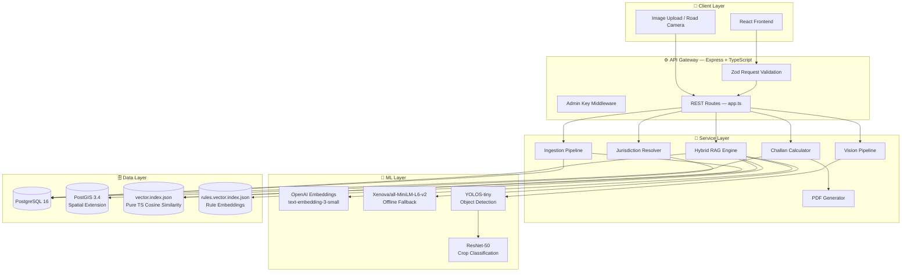
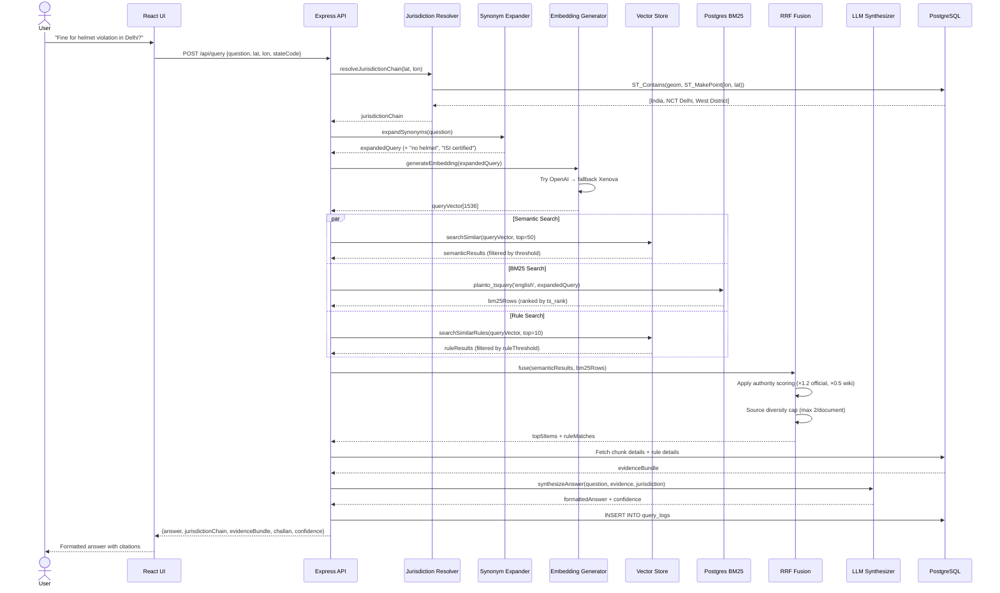
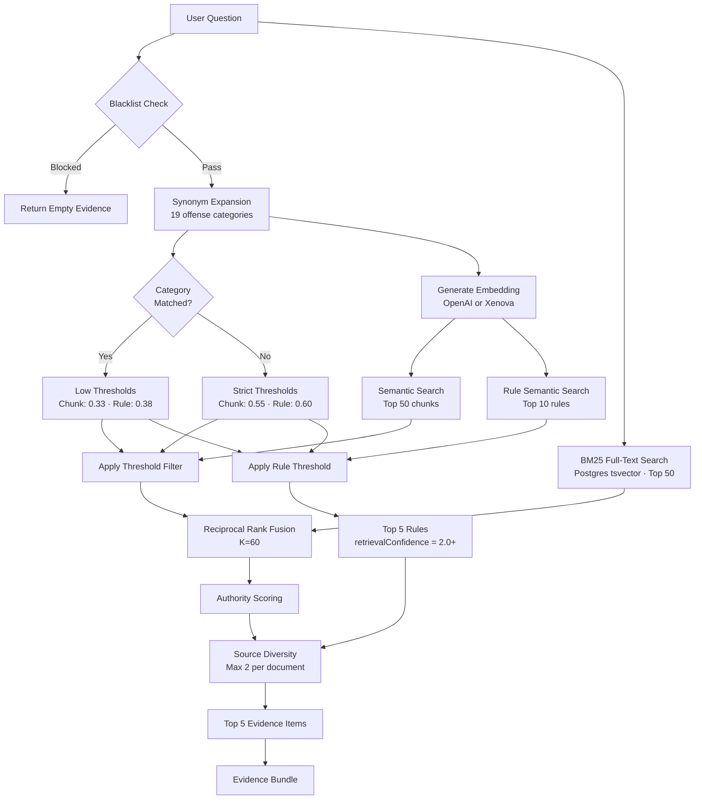
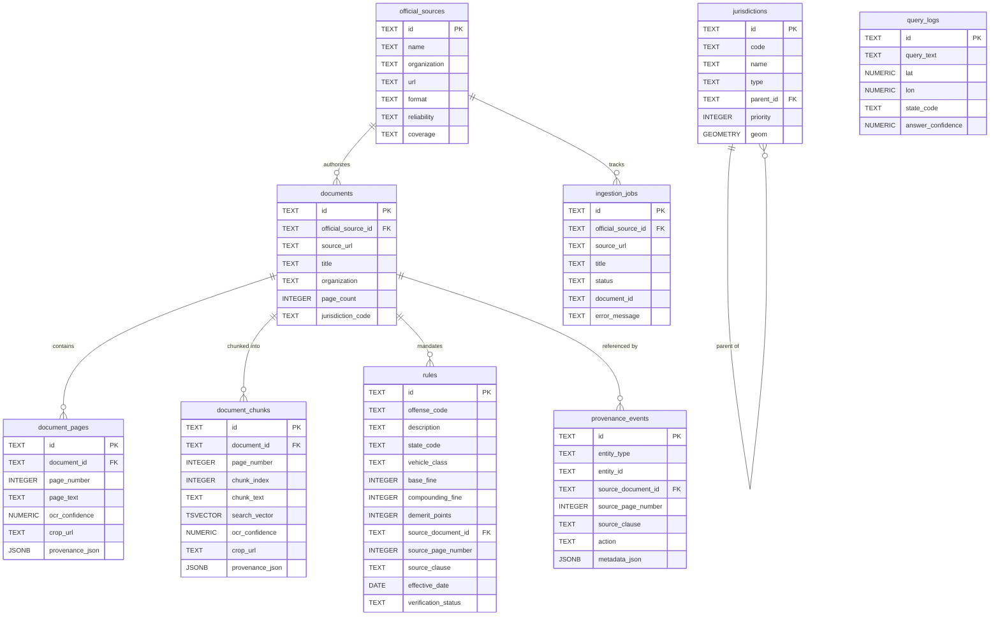
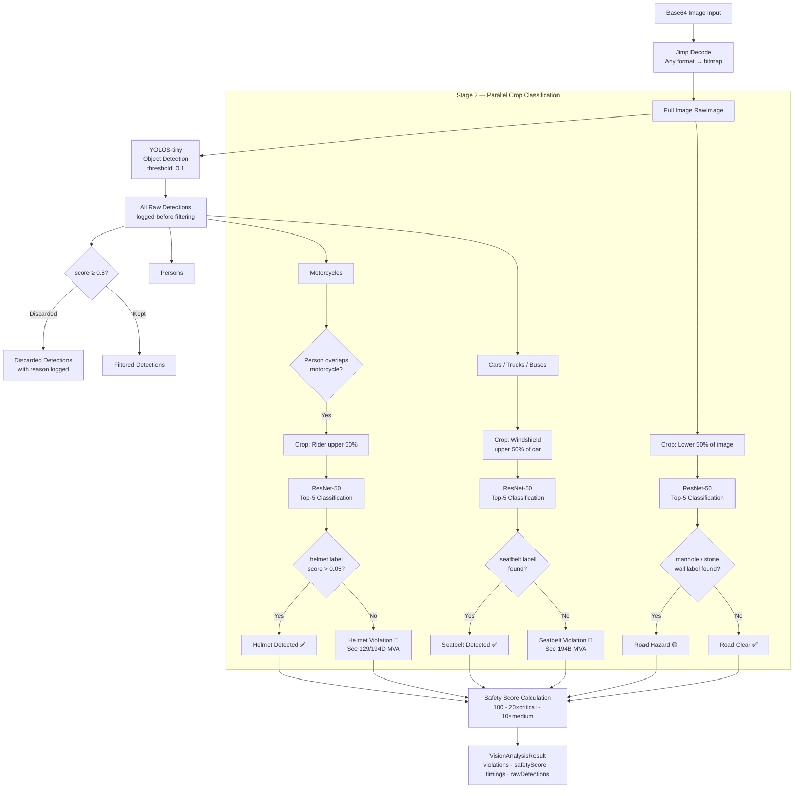
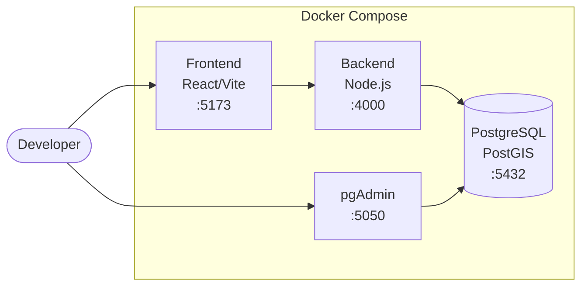

# DriveLegal — System Architecture

## Overview

DriveLegal is a multi-layer AI system built on a **provenance-first** principle: every legal answer must trace back to an official government document with a specific page number and statutory clause. This document covers the complete system design, component interactions, data flows, and key engineering decisions.

---

## High-Level Architecture

---

## Request Flow — Natural Language Query

---

## RAG Pipeline Detail

---

## Database Schema Flow

---

## Computer Vision Pipeline

---

## Deployment Architecture

---

## Key Indexes

| Table | Index | Type | Purpose |
|---|---|---|---|
| `jurisdictions` | `jurisdictions_geom_gix` | GIST | Spatial point-in-polygon queries |
| `document_chunks` | `document_chunks_search_gix` | GIN | BM25 full-text search |
| `document_chunks` | `document_chunks_jurisdiction_gix` | GIN | Jurisdiction-scoped chunk retrieval |
| `rules` | `rules_state_ix` | B-tree | State + offense + vehicle class + date lookup |
| `rules` | `rules_search_gix` | GIN | Rule full-text search |

---

## Performance Characteristics

| Operation | Latency (warm) | Notes |
|---|---|---|
| Jurisdiction resolution | < 5ms | PostGIS GIST index on 694 geometries |
| Embedding generation (OpenAI) | 80–150ms | Network + API |
| Embedding generation (Xenova) | 2000ms cold / 40ms warm | ONNX model warm-up |
| Cosine similarity (1000 vectors) | < 5ms | Pure TypeScript, in-memory |
| BM25 search (950 chunks) | < 10ms | Postgres tsvector + GIN index |
| Full query pipeline (warm) | ~158ms | All stages combined |
| Vision pipeline (warm) | ~185ms total | Decode + YOLOS + crops + classifier |
