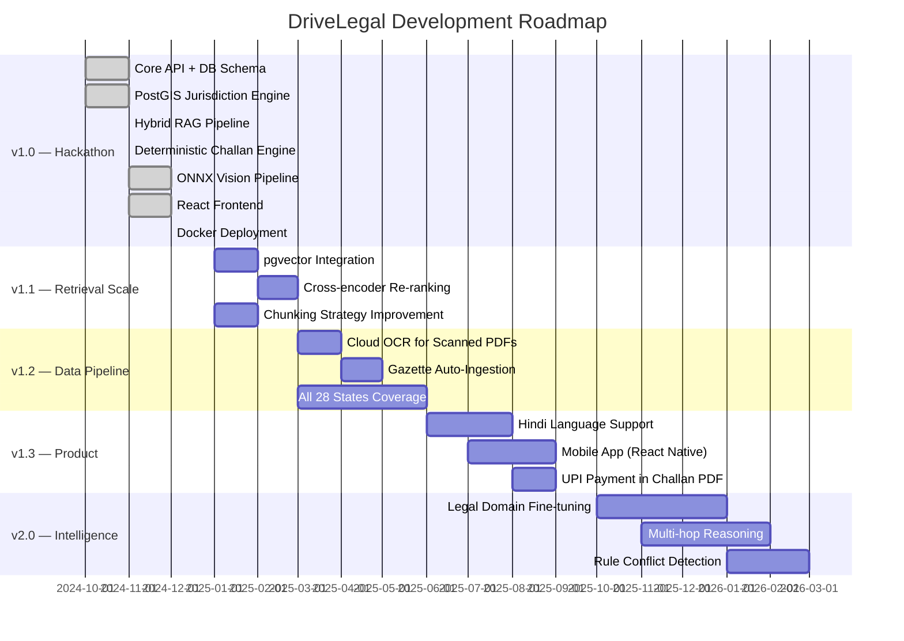

# DriveLegal — Project Roadmap

**Last updated:** June 2024  
**Current version:** v1.0.0 (IIT Madras Hackathon Release)

---

## Vision

DriveLegal aims to become India's most authoritative, open, and auditable road safety legal intelligence platform — one where every citizen can instantly verify what traffic law applies to them, in their jurisdiction, with a full citation trail to the official statute.

---

## Milestones

---

## v1.0.0 — Hackathon Release ✅ Complete

### Core Infrastructure
- [x] Provenance-first PostgreSQL 16 schema with 8 tables
- [x] PostGIS 3.4 spatial extension for geo-resolution
- [x] Docker Compose (PostgreSQL + pgAdmin + Backend + Frontend)
- [x] Zod-validated environment configuration
- [x] PostgreSQL connection pool with transaction helpers + graceful shutdown

### Retrieval System
- [x] Hybrid RAG: BM25 (Postgres tsvector) + Semantic cosine similarity
- [x] Reciprocal Rank Fusion (RRF, K=60)
- [x] Authority scoring (official sources: ×1.2, Wikipedia: ×0.5)
- [x] Source diversity cap (max 2 items per document)
- [x] Synonym expansion across 23 Indian traffic offense categories
- [x] Similarity threshold gates (per-category and strict mode)
- [x] SQL injection + off-topic query blacklist

### Embeddings
- [x] OpenAI `text-embedding-3-small` (1536-dim) primary
- [x] Xenova `all-MiniLM-L6-v2` (384-dim) offline fallback
- [x] Zero-native-dependency TypeScript vector store
- [x] Separate chunk and rule vector indices

### Jurisdiction Engine
- [x] PostGIS `ST_Contains` for 694 Indian administrative boundaries
- [x] District → State → National hierarchy
- [x] Delhi/NCT dual-jurisdiction aliasing

### Challan Engine
- [x] Rule-based deterministic fine calculator (0% LLM)
- [x] Vehicle class specificity + wildcard matching
- [x] Repeat offense (+50%), commercial (+10%), court compounding modifiers
- [x] Full provenance on every fine line item
- [x] **22 Vitest unit tests — 100% passing**

### Computer Vision
- [x] Stage 1: YOLOS-tiny object detection (ONNX, offline)
- [x] Stage 2: ResNet-50 crop classification (ONNX, offline)
- [x] Helmet detection: F1 = **0.938**
- [x] Seatbelt detection: F1 = **0.898**
- [x] Road hazard detection: F1 = **0.955**
- [x] Stage timing breakdown

### Document Pipeline
- [x] PDF ingestion with native text extraction
- [x] Tesseract.js OCR fallback
- [x] 5 official sources, 55 documents, 950 chunks

### Data
- [x] 109 verified traffic rules (DL, MH, TN, KA + national)
- [x] 694 jurisdiction boundaries loaded

---

## v1.1 — Retrieval Scale 🔄 Planned (Q1 2025)

### pgvector Migration
- [ ] Add `pgvector` extension to PostgreSQL schema
- [ ] Migrate chunk embeddings from JSON flat-file to `vector` column
- [ ] Migrate rule embeddings to `vector` column
- [ ] HNSW index for approximate nearest-neighbor at 100k+ scale
- [ ] Benchmark: JSON cosine vs pgvector HNSW at 10k, 50k, 100k vectors

### Cross-encoder Re-ranking
- [ ] Integrate `cross-encoder/ms-marco-MiniLM-L-6-v2` as post-RRF re-ranker
- [ ] A/B test: RRF alone vs RRF + cross-encoder
- [ ] Target: NDCG@5 improvement ≥ 5%

### Chunking Improvements
- [ ] Implement sliding window with semantic boundary detection
- [ ] Sentence-aware chunking (no mid-sentence splits)
- [ ] Increase overlap from 150 to 200 chars for better context preservation

---

## v1.2 — Data Pipeline 🔄 Planned (Q2 2025)

### Cloud OCR
- [ ] AWS Textract integration for scanned government PDFs
- [ ] Google Document AI fallback
- [ ] Confidence thresholding: skip OCR if native text confidence > 0.95

### Automated Gazette Ingestion
- [ ] MoRTH Gazette RSS/webhook monitor
- [ ] Rule diff detection (new rule vs amendment vs repeal)
- [ ] Human-in-the-loop verification queue for new rules
- [ ] Email notification to admins on new gazette entries

### State Coverage Expansion
- [ ] Current: DL, MH, TN, KA + national (MVA)
- [ ] Target: All 28 states + 8 UTs
- [ ] Priority states: GJ, WB, RJ, UP, HR (high traffic volume)

---

## v1.3 — Product 🔄 Planned (Q3 2025)

### Hindi Language Support
- [ ] Hindi query translation using IndicTrans2
- [ ] Hindi rule text ingestion
- [ ] Bilingual response generation
- [ ] UI language toggle (EN / HI)

### Mobile App
- [ ] React Native app with native GPS integration
- [ ] Offline-first: cached rules for last-used state
- [ ] Camera integration for on-device vision analysis
- [ ] Push notifications for new rule updates

### Fine Payment Integration
- [ ] UPI deep-link in challan PDF (GPay, PhonePe, Paytm)
- [ ] Challan QR code readable by Parivahan app
- [ ] Payment receipt generation

### Fleet Dashboard
- [ ] Multi-vehicle compliance monitoring
- [ ] Driver violation history
- [ ] Bulk challan generation
- [ ] CSV/Excel export

---

## v2.0 — Intelligence 🔄 Planned (Q4 2025–Q1 2026)

### Legal Domain Fine-tuning
- [ ] Collect annotated QA pairs from Indian traffic law
- [ ] Fine-tune `legal-BERT-base` on motor vehicles domain
- [ ] Replace `all-MiniLM-L6-v2` with domain-specific encoder
- [ ] Target: MRR@10 improvement ≥ 15% vs base model

### Multi-hop Reasoning
- [ ] Chain-of-thought prompting for complex scenarios
  - Example: "I'm a commercial vehicle driver in Delhi with a repeat DUI offense — what is my total penalty?"
- [ ] Multi-step jurisdiction resolution for border districts
- [ ] Cross-state offense comparison

### Rule Conflict Detection
- [ ] Detect when state rule contradicts national MVA provision
- [ ] Flag effective date overlaps between rule versions
- [ ] Automated conflict report generation for admin review

---

## Contributing to the Roadmap

If you want to work on any of these items:
1. Check [open issues](../../issues) for existing discussion
2. Open a new issue with the `enhancement` label
3. Reference the roadmap item in your issue
4. Follow the [contribution guide](../CONTRIBUTING.md)

---

## Success Metrics

| Metric | v1.0 Baseline | v1.1 Target | v2.0 Target |
|---|---|---|---|
| Chunk scale | 950 | 50,000 | 500,000 |
| State coverage | 4 states | 10 states | 36 states/UTs |
| Query latency (warm) | 158ms | 120ms | 80ms |
| Retrieval NDCG@5 | ~0.72 (estimated) | 0.80 | 0.88 |
| Vision F1 (helmet) | 0.938 | 0.950 | 0.970 |
| Test coverage | ~35% | 60% | 80% |
| Languages | English | English + Hindi | EN + HI + 4 regional |
